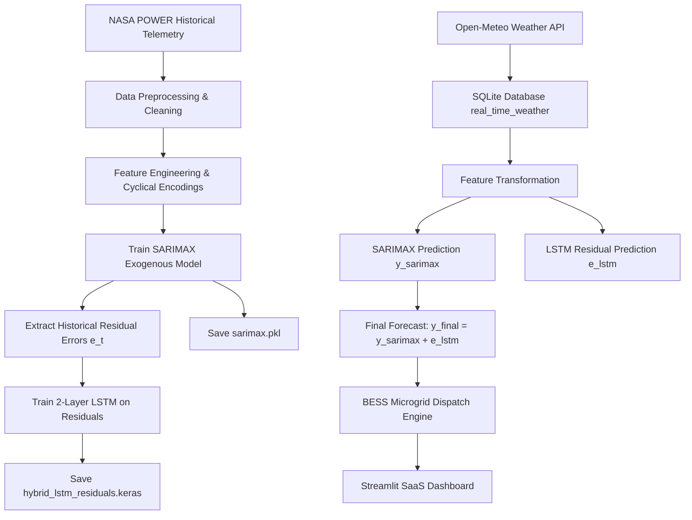

# ☀️ Hybrid Solar Power Forecasting using SARIMAX-LSTM with BESS

[](https://streamlit.io/)
[](https://www.python.org/)
[](LICENSE)

An enterprise-grade, AI-powered solar generation forecasting platform and Battery Energy Storage System (BESS) dispatch simulator. The application utilizes a **TRUE Hybrid SARIMAX-LSTM architecture** where a SARIMAX linear model captures baseline meteorological trends and exogenous variables, while a Deep Learning 2-Layer LSTM network is trained exclusively on SARIMAX residual errors to predict high-frequency non-linear atmospheric corrections.

---

## 🌟 Key Features

- **TRUE Hybrid SARIMAX-LSTM Architecture**:
  - Linear SARIMAX baseline model ($\hat{y}_{\text{SARIMAX}}$) driven by temperature, humidity, wind speed, solar irradiance, and cloud attenuation index.
  - Residual-trained LSTM model ($\hat{e}_{\text{LSTM}}$) predicting residual correction errors.
  - Final Prediction: $\hat{y}_{\text{final}}(t) = \hat{y}_{\text{SARIMAX}}(t) + \hat{e}_{\text{LSTM}}(t)$.
- **Live Open-Meteo Weather Synchronization**: Real-time hourly weather telemetry for major Indian solar hubs (Chennai, New Delhi, Mumbai, Bengaluru, Hyderabad, Kolkata, Ahmedabad, Pune).
- **SQLite Fleet Data Pipeline**: Telemetry from Open-Meteo API is stored directly in SQLite database (`database/solar_data_fleet.db`), queried, feature-engineered, and passed into models.
- **Microgrid BESS Dispatch Engine**: Dynamic Battery Energy Storage System simulator computing hourly State-of-Charge (SOC %), charging/discharging power, grid import/export, and surplus curtailment.
- **Mathematical Demand Profile**: City-specific diurnal load curve with morning peak, evening peak, night dip, weekend factors, and adjustable peak load modifier slider.
- **Secure Enterprise Authentication System**: Glassmorphic login page restricting dashboard access (Default Credentials: Username `admin`, Password `admin123`).
- **Glassmorphic SaaS Dark Mode UI**: Built with custom CSS, luminous gradients, metric KPI cards, and responsive interactive Plotly visual suites.

---

## 📐 Machine Learning Architecture



---

## 📁 Project Structure

```
hybrid_solar/
├── app.py                      # Main Streamlit SaaS application
├── requirements.txt            # Python dependencies
├── config.py                  # Global settings, paths, city coordinates, BESS defaults
├── README.md                   # Comprehensive project documentation
├── .gitignore                  # Git exclusion rules
│
├── models/                     # Pre-trained model artifacts
│   ├── sarimax.pkl
│   ├── hybrid_lstm_residuals.keras
│   └── scalers.pkl
│
├── database/                   # SQLite database directory
│   └── solar_data_fleet.db
│
├── data/                       # Historical NASA POWER data
│   ├── raw/
│   │   └── nasa_power_solar_data.csv
│   └── processed/
│
├── src/                        # Modular source codebase
│   ├── preprocessing.py        # Cleaning, missing values, outlier clipping, splits
│   ├── feature_engineering.py  # Cyclical encodings, cloud index, lag & rolling features
│   ├── dataset_generator.py    # Synthetic NASA POWER solar dataset generator
│   ├── train_sarimax.py        # SARIMAX model training & residual extraction
│   ├── train_lstm.py           # PyTorch/Keras LSTM residual model training
│   ├── predict.py              # Production inference engine (load pretrained models only)
│   ├── battery.py              # Demand curve generation & BESS dispatch simulation
│   ├── database.py             # SQLite database management layer
│   ├── weather_api.py          # Open-Meteo API connector & SQLite sync
│   ├── visualization.py        # Dark-mode interactive Plotly chart suite
│   └── evaluation.py           # Empirical MAE, RMSE, MAPE, R2 evaluation metrics
│
└── assets/                     # Custom UI styling
    └── custom.css              # Glassmorphic dark mode styling sheet
```

---

## ⚡ Quick Start & Local Setup

### 1. Clone & Environment Setup
```bash
git clone https://github.com/abixheak/hybrid-solar-forecasting-bess.git
cd hybrid-solar-forecasting-bess

# Create virtual environment
python -m venv venv
source venv/bin/activate  # On Windows: venv\Scripts\activate

# Install dependencies
pip install -r requirements.txt
```

### 2. Generate Dataset & Train Pre-trained Model Pipeline
```bash
# Train SARIMAX and extract residuals
python -m src.train_sarimax

# Train LSTM on SARIMAX residuals
python -m src.train_lstm
```
This generates `models/sarimax.pkl`, `models/hybrid_lstm_residuals.keras`, and `models/scalers.pkl`.

### 3. Launch Streamlit SaaS Dashboard
```bash
streamlit run app.py
```
Open your browser at `http://localhost:8501`.

---

## 📊 Evaluation Metrics

The platform calculates empirical regression metrics comparing the baseline SARIMAX against the Hybrid SARIMAX-LSTM model:

$$\text{MAE} = \frac{1}{N} \sum_{t=1}^N |y_t - \hat{y}_t|$$

$$\text{RMSE} = \sqrt{\frac{1}{N} \sum_{t=1}^N (y_t - \hat{y}_t)^2}$$

$$\text{MAPE} = \frac{100\%}{N} \sum_{t=1}^N \frac{|y_t - \hat{y}_t|}{|y_t| + \epsilon}$$

$$R^2 = 1 - \frac{\sum (y_t - \hat{y}_t)^2}{\sum (y_t - \bar{y})^2}$$

---

## 🐙 Pushing to GitHub

Follow these steps to initialize and push this project to your GitHub repository:

```bash
# 1. Initialize Git Repository (if not already initialized)
git init -b main

# 2. Add all project files and track directory structures (.gitkeep)
git add .

# 3. Commit files locally
git commit -m "feat: initial commit for Hybrid SARIMAX-LSTM Solar & BESS Platform"

# 4. Link to your GitHub remote repository
git remote add origin https://github.com/abixheak/hybrid-solar-forecasting-bess.git

# 5. Push to GitHub main branch
git push -u origin main
```

---

## 🚀 Streamlit Cloud Deployment Instructions

1. Push project to GitHub repository.
2. Log into [Streamlit Community Cloud](https://share.streamlit.io/).
3. Click **New app**, select your repository and set main file path to `app.py`.
4. Deploy! Pre-trained model artifacts inside `models/` will load automatically without retraining on startup.

---

## 📜 License

Distributed under the MIT License.
